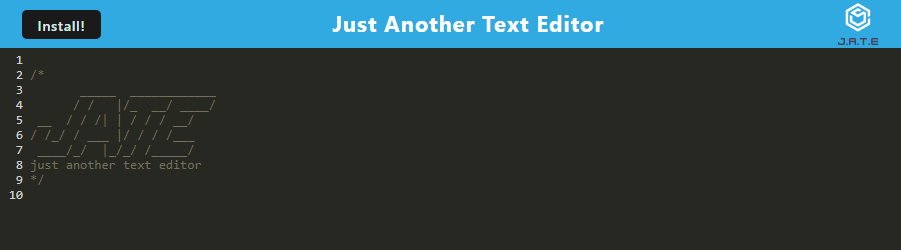
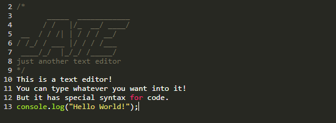
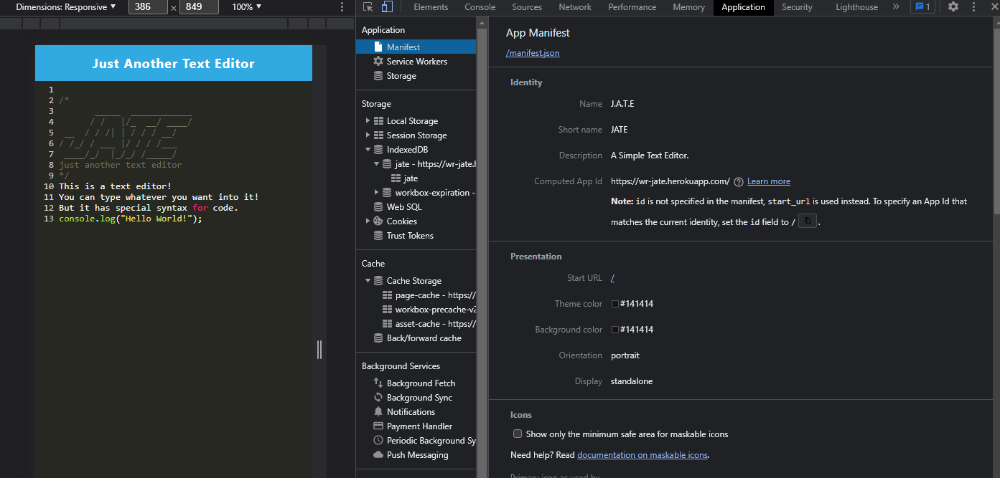
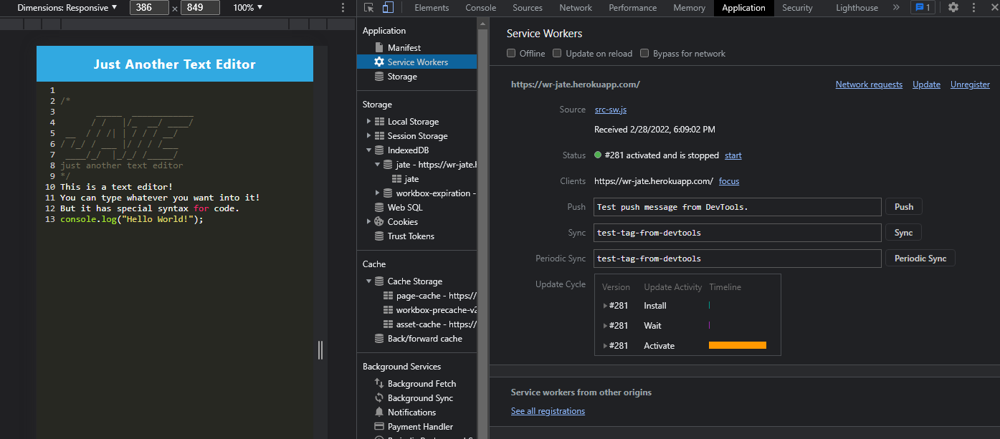
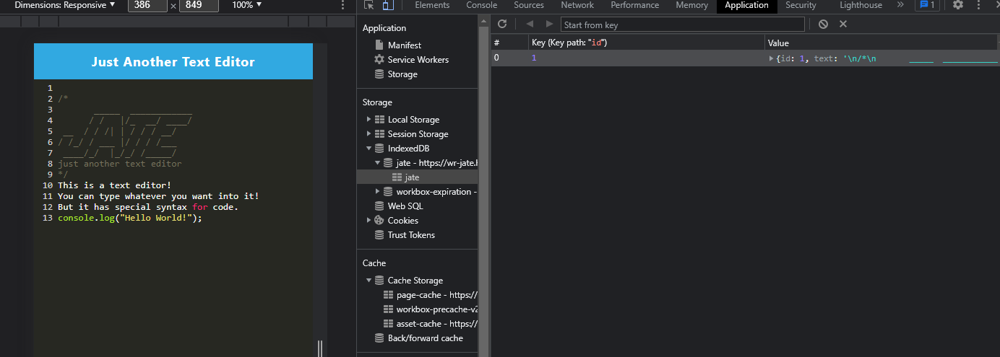
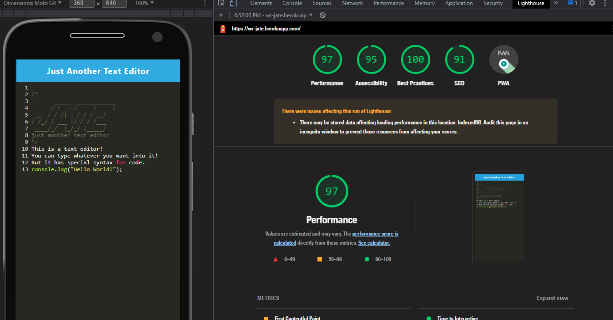

# PWA Text Editor

## Table of Contents

- [PWA Text Editor](#pwa-text-editor)
  - [Table of Contents](#table-of-contents)
  - [Description](#description)
  - [Deployment](#deployment)
  - [Installation](#installation)
  - [Usage](#usage)
  - [Contributing](#contributing)
  - [Tests](#tests)
  - [Screenshots](#screenshots)
  - [License](#license)
  - [Questions](#questions)

## Description

A project for my bootcamp to setup a simple text editor, named J.A.T.E (Just Another Text Editor) that meets the standards of a PWA. The editor has a service worker that caches and serves the static elements when the app is offline, uses indexDB storage for the text information, and has a manifest that allows the web app to be installed on various devices. The entire program is also bundled with Webpack to compress the packages and make them load easier.

## Deployment

[See the appy deployed on Heroku here.](https://wr-jate.herokuapp.com/)

## Installation

To host your own version of this app, download the repository, and then in the terminal, on the repository, run `npm install`. Once that finishes running, you can run `npm start`, and the application will be hosted locally on port 3000.

## Usage

To use the app, just type in the editor! You can press enter to go to a new line and when you click off of the screen, the text will automatically save. 

You can also install the web application to your device with the install button.

## Contributing

Anyone can fork this project and add features. However, all changes to the main section must be approved by the Admin.

## Tests

There are no testing procedures for this project.

## Screenshots

## License

This project is licensed under a [MIT license](https://opensource.org/licenses/MIT).

## Questions

If you have any questions, please send them to [WRuback](https://github.com/WRuback) at wrubackdev@gmail.com with the heading "PWA Text Editor Question".
